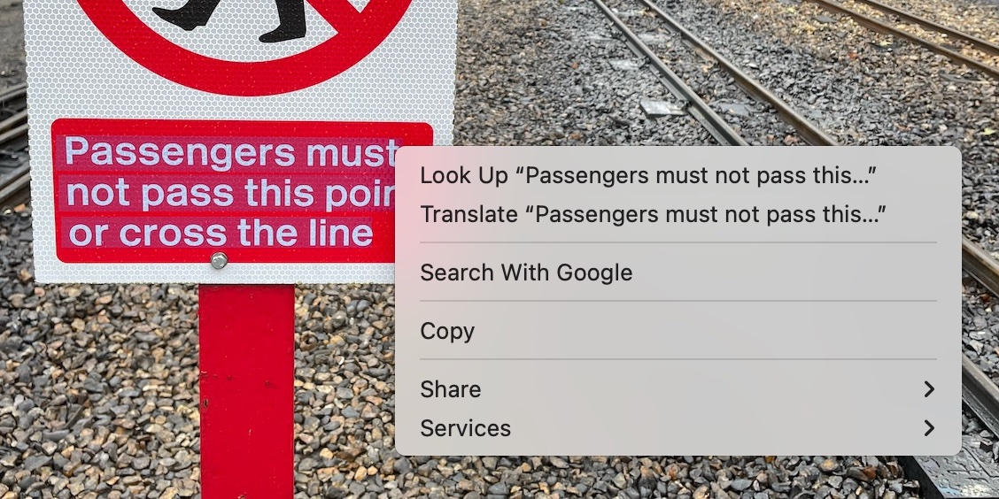

# get_live_text

This tool uses Apple’s [Live Text feature](https://support.apple.com/en-gb/guide/preview/prvw625a5b2c/mac) to get text from an image on the command line.
This gives you a way to OCR images programatically without installing any extra software.

```console
$ get_live_text "railway_sign.jpg"
```

This is the same as if you'd copy/pasted the text from the image using the Preview app, but now you can do so programatically and in bulk.



## Motivation

My priority is convenience, not absolute accuracy.

I've had issues installing third-party OCR tools in the past, whereas Live Text is built into macOS.
It's pretty quick for me to get this up and running on a new machine.

There may be other frameworks which provide more accurate transcription of text, but Live Text is good enough for my purposes.
Currently I have two use cases for this script:

*   Transcribing screenshots from my ebook reader, to add to my notes app.
    I go through and edit those transcripts, so I can fix any mistakes it’s made.
*   Creating search indexes of scanned images, where a little bit of inaccuracy is fine, as long as it's good enough for me to find the right image.

## Installation

### Install from source

1.  Install the Xcode Command Line Tools
2.  Download the `get_live_text.swift` script from this repo
3.  Compile the script into a binary:

    ```console
    $ swiftc get_live_text.swift
    ```

4.  Copy the compiled binary `get_live_text` to somewhere in your PATH.

### Install a compiled binary

1.  Find the latest [GitHub release](https://github.com/alexwlchan/get_live_text/releases)
2.  Download the zip file which is appropriate for your system (Intel = `x86_64`, Apple Silion = `aarch64`)
3.  Open the zip file, and add the `get_live_text` app to your PATH

The app is just a compiled version of the Swift script.
It isn't notarised, so when you run it, you may get a warning that this app is from an unidentified developer.
You can get around this by right-clicking the app icon in Finder, and choosing `Open` from the shortcut menu.

## Usage

Run the script passing one arguments: the path to the image you want to OCR.

```console
$ get_live_text "railway_sign.jpg"
```
